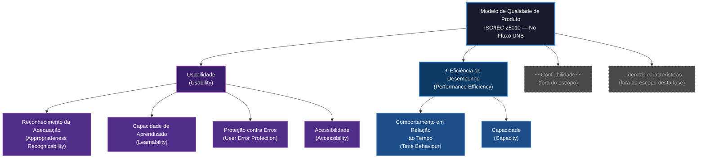

## Como chegamos nessas características

Para definir o modelo de qualidade, foi utilizada como referência a norma **ISO/IEC 25010:2011**, que faz parte da série SQuaRE e organiza a qualidade de software em características definidas. Ela funciona como um mapa: ajuda a saber o que avaliar e por quê.

### Características Selecionadas

Nesta etapa inicial do processo de avaliação, foram definidas as características de qualidade a serem consideradas com base nos objetivos da avaliação e nos usuários finais do produto, com objetivo de identificar características críticas para a experiência de planejamento acadêmico e o desempenho do sistema.

Foram priorizadas as características de **Usabilidade** e **Eficiência de Desempenho**, devido à sua relação direta com a facilidade de aprendizado, prevenção de erros, agilidade no tempo de resposta da aplicação e capacidade de suportar os diferentes tipos de fluxogramas propostos pela universidade, visando garantir aspectos fundamentais para um público composto por estudantes da Universidade de Brasília (UnB), que necessitam de uma ferramenta prática, rápida e de fácil entendimento para contornar a complexidade existente nos fluxos de disciplinas.

### 1. Usabilidade

* **Reconhecimento da Adequação** *(Appropriateness Recognizability)*: Avalia se o estudante, ao acessar o sistema pela primeira vez, consegue identificar que a ferramenta serve para planejar sua grade curricular com base no seu histórico. A interface precisa deixar claro — por meio de chamadas visuais e instruções objetivas — que o upload do histórico e a seleção do fluxograma são o ponto de entrada, evitando que o usuário se questione se está no lugar certo.

* **Capacidade de Aprendizado** *(Learnability)*: Mede a facilidade com que um aluno consegue, sem auxílio externo, entender o fluxo de uso: enviar o histórico, selecionar o curso e interpretar o resultado visual com as disciplinas classificadas por status e semestre.

* **Proteção contra Erros do Usuário** *(User Error Protection)*: Examina se o sistema protege o aluno de erros, como envio de um arquivo de histórico em formato inválido, seleção de um fluxograma incompatível com o seu curso ou interpretação incorreta de pré-requisitos.

* **Acessibilidade** *(Accessibility)*: Examina o grau em que o sistema pode ser usado de forma eficaz por estudantes com a mais ampla variedade de características e capacidades físicas ou cognitivas, incluindo limitações associadas à idade ou deficiências.

### 2. Eficiência de Desempenho

* **Comportamento em Relação ao Tempo** *(Time Behaviour)*: Analisa a velocidade de resposta após o envio do histórico e a seleção do fluxograma — o tempo até o sistema processar as regras de pré-requisitos e renderizar o resultado visual deve ser suficientemente baixo para não frustrar o usuário.

* **Capacidade** *(Capacity)*: Verifica se o sistema suporta a variedade de fluxogramas cadastrados e a diversidade de históricos escolares enviados — que podem diferir em tamanho, formato e quantidade de disciplinas.

---

## A relação entre as duas características

Essas duas características não são independentes — elas se influenciam. Um sistema que responde dentro dos tempos esperados tende a ser mais utilizável, pois reduz a carga cognitiva do usuário durante a interação. E um sistema com boa usabilidade permite que o usuário conclua as tarefas sem erros, o que gera menos reprocessamentos e, consequentemente, menos pressão sobre o desempenho.

Na prática, isso significa que analisar as duas em conjunto contribui para entender não só *o que* está ocorrendo, mas *por quê* — se uma dificuldade de uso é resultado de um problema de interface ou de uma limitação de tempo de resposta, por exemplo.

---

## O que ficou fora do escopo e por quê

Nem tudo do modelo ISO/IEC 25010 foi incluído. As escolhas foram intencionais:

- **Confiabilidade** e **Segurança** são características importantes para este software por conta da privacidade do usuário, mas a **Usabilidade** e **Eficiência** se destacaram como mais importantes;
- **Manutenibilidade** e **Portabilidade** não são preocupações centrais para um sistema web de acesso público nesta fase;
- Dentro de **Eficiência de Desempenho**, a subcaracterística **Capacidade** recebeu atenção por refletir a diversidade de cursos e históricos que o sistema precisa suportar;
- Dentro de **Usabilidade**, a subcaracterística **Acessibilidade** foi incluída por ser relevante para um público universitário com características variadas.

---

## Representação Gráfica do Modelo de Qualidade

O diagrama abaixo mostra como o modelo foi estruturado — em roxo, as subcaracterísticas de Usabilidade; em azul, as de Eficiência de Desempenho; em cinza tracejado, o que ficou fora do escopo desta fase.

> **Legenda:**
> - **Roxo** — Usabilidade e suas subcaracterísticas (em escopo)
> - **Azul escuro** — Eficiência de Desempenho e suas subcaracterísticas (em escopo)
> - **Cinza tracejado** — Características excluídas do escopo desta avaliação

---

## Escopo, Profundidade e Objetos de Avaliação

| Dimensão | Descrição |
|---|---|
| **Abrangência** | Sistema web No Fluxo UNB em produção, acessível em https://no-fluxo.crianex.com |
| **Objetos de avaliação** | Módulo Meu Fluxograma (renderização e interação), Módulo de Importação de Histórico (upload SIGAA), Assistente Darcy AI (integração com Maritaca AI) |
| **Profundidade** | Avaliação caixa-preta com medições de tempo de resposta, testes de carga e verificação de comportamento em cenários de uso |
| **Relação com fases futuras** | Os resultados desta fase vão alimentar a definição das métricas e dos limiares de aceitação utilizados nas próximas etapas da avaliação |

---

## Referências

- Documento elaborado com base na norma ISO/IEC 25010:2011 e nas diretrizes da disciplina FGA315 — Qualidade de Software.
- Avaliação referente ao software [No Fluxo UNB](https://no-fluxo.crianex.com/)

---

## Histórico de versão

| Versão | Data | Descrição | Autor |
|---|---|---|---|
| 1.0 | 12/05/26 | Criação da página inicial | Camila Careli |
| 1.1 | 12/05/26 | Revisão do conteúdo | Camila Careli |
| 1.2 | 13/05/26 | Correção das características | Ígor Veras |
