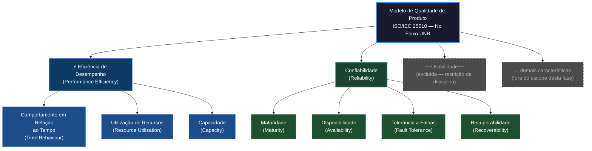

## Como chegamos nessas características

Para definir o modelo de qualidade, usamos como referência a norma **ISO/IEC 25010:2011**, que faz parte da série SQuaRE e organiza a qualidade de software em características bem definidas. Ela funciona como um mapa: ajuda a saber o que avaliar e por quê.

De todas as características disponíveis nessa norma, selecionamos **Eficiência de Desempenho** e **Confiabilidade**. Não foi uma escolha aleatória — ela veio da observação do próprio sistema e do contexto em que ele é usado. Um sistema acadêmico que demora para carregar ou que cai no dia da matrícula gera um prejuízo real para o estudante. Essas duas características capturam exatamente esse risco.

### 1. Eficiência de Desempenho

O No Fluxo UNB faz coisas computacionalmente pesadas: processa grafos de pré-requisitos, lê PDFs de histórico, renderiza fluxogramas interativos e ainda conversa com uma IA externa. Tudo isso precisa acontecer de forma fluida, sem fazer o usuário esperar demais ou sentir que o sistema está travado.

| Subcaracterística | O que avalia | Por que importa aqui |
|---|---|---|
| **Comportamento em Relação ao Tempo** *(Time Behaviour)* | Quanto tempo o sistema leva para responder | O tempo entre o upload do histórico e a aparição do fluxograma — e o tempo de resposta do Darcy AI — são críticos para a experiência |
| **Utilização de Recursos** *(Resource Utilization)* | Como o sistema usa CPU, memória e rede | Fluxogramas com muitas disciplinas e dependências podem sobrecarregar o sistema se os recursos não forem bem gerenciados |
| **Capacidade** *(Capacity)* | O quanto o sistema aguenta em termos de volume | São 518 cursos cadastrados e históricos com tamanhos e complexidades bem diferentes — o sistema precisa dar conta de todos |

### 2. Confiabilidade

O estudante deposita confiança no sistema quando faz upload do seu histórico e espera que o fluxograma reflita fielmente sua situação acadêmica. Se o sistema falhar nesse momento — ou pior, exibir informações erradas — o impacto é sério. Por isso a confiabilidade não é apenas uma característica técnica, ela tem um peso humano importante aqui.

| Subcaracterística | O que avalia | Por que importa aqui |
|---|---|---|
| **Maturidade** *(Maturity)* | Com que frequência o sistema falha em condições normais | Erros recorrentes no processamento do histórico ou na renderização do fluxograma comprometem a confiança do usuário |
| **Disponibilidade** *(Availability)* | Se o sistema está no ar quando precisa estar | Nos períodos de matrícula, uma queda pode impedir o estudante de planejar sua grade em tempo hábil |
| **Tolerância a Falhas** *(Fault Tolerance)* | Se o sistema continua funcionando mesmo quando algo externo falha | O SIGAA e a Maritaca AI podem ter instabilidades — o sistema precisa lidar com isso sem travar tudo |
| **Recuperabilidade** *(Recoverability)* | Se o sistema volta ao normal depois de uma falha | Um timeout durante o upload não deveria forçar o estudante a recomeçar tudo do zero |

---

## A relação entre as duas características

Essas duas características não são independentes — elas se influenciam. Um sistema que responde rápido tende a ser mais estável, porque passa menos tempo exposto a condições que favorecem falhas. E um sistema confiável garante que os tempos medidos sejam representativos do uso real, sem distorções causadas por falhas intermitentes.

Na prática, isso significa que analisar as duas juntas vai nos ajudar a entender não só *o que* está acontecendo, mas *por que* — se um tempo de resposta alto é um problema de desempenho ou um sintoma de instabilidade, por exemplo.

## O que ficou fora do escopo e por quê

Nem tudo do modelo ISO/IEC 25010 foi incluído. As escolhas foram intencionais:

- **Usabilidade** foi excluída por restrição da própria disciplina;
- **Segurança** e **Manutenibilidade** dependem de aspectos do ambiente e do processo de desenvolvimento que estão além do produto entregue e fora do controle direto desta avaliação;
- **Portabilidade** não é uma preocupação central para um sistema web de acesso público;
- Dentro de **Eficiência de Desempenho**, a subcaracterística **Capacidade** ganhou destaque especial por refletir diretamente a diversidade de cursos e históricos que o sistema precisa suportar.

## Representação Gráfica do Modelo de Qualidade

O diagrama abaixo mostra como o modelo foi estruturado — em azul, as subcaracterísticas de Eficiência de Desempenho; em verde, as de Confiabilidade; em cinza tracejado, o que ficou fora do escopo desta fase.

> **Legenda:**
> - **Azul escuro** — Eficiência de Desempenho e suas subcaracterísticas (em escopo)
> - **Verde escuro** — Confiabilidade e suas subcaracterísticas (em escopo)
> - **Cinza tracejado** — Características excluídas do escopo desta avaliação

## Escopo, Profundidade e Objetos de Avaliação

| Dimensão | Descrição |
|---|---|
| **Abrangência** | Sistema web No Fluxo UNB em produção, acessível em https://no-fluxo.crianex.com |
| **Objetos de avaliação** | Módulo Meu Fluxograma (renderização e interação), Módulo de Importação de Histórico (upload SIGAA), Assistente Darcy AI (integração com Maritaca AI) |
| **Profundidade** | Avaliação caixa-preta com medições de tempo de resposta, testes de carga e verificação de comportamento em cenários de falha |
| **Relação com fases futuras** | Os resultados desta fase vão alimentar a definição das métricas e dos limiares de aceitação utilizados nas próximas etapas da avaliação |

## ODS Relacionados

O No Fluxo UNB não é só uma ferramenta técnica — ele tem impacto social direto. Sua relação com os Objetivos de Desenvolvimento Sustentável da ONU reflete isso:

| ODS | Meta | Indicador | Por que se conecta ao No Fluxo UNB |
|---|---|---|---|
| **ODS 4 — Educação de Qualidade** | 4.3 — Garantir acesso igualitário ao ensino superior | 4.3.1 — Taxa de participação no ensino superior | O sistema facilita o acesso ao planejamento acadêmico para estudantes de todos os cursos, independentemente de quanto entendem da estrutura curricular da UnB |
| **ODS 4 — Educação de Qualidade** | 4.4 — Aumentar competências e habilidades relevantes | 4.4.1 — Taxa de conclusão no ensino superior | Ao deixar os pré-requisitos e o fluxo do curso mais visíveis, o sistema ajuda estudantes a se organizar melhor e, potencialmente, a reduzir reprovações e atrasos na formação |
| **ODS 9 — Indústria, Inovação e Infraestrutura** | 9.c — Aumentar o acesso às TICs | 9.c.1 — Cobertura de redes móveis | O sistema funciona no navegador, sem instalação, e tem potencial de alcançar estudantes com diferentes realidades de dispositivo e conectividade |

---

## Referências

- Documento elaborado com base na norma ISO/IEC 25010:2011 e nas diretrizes da disciplina FGA315 — Qualidade de Software.
- Avaliação referente ao software [No Fluxo UNB](https://no-fluxo.crianex.com/)

---

## Histórico de versão

| Versão | Data | Descrição | Autor |
|---|---|---|---|
| 1.0 | 12/05/26 | Criação da página inicial | Camila Careli |
| 1.1 | 12/05/26 | Revisão do conteúdo | Camila Careli |