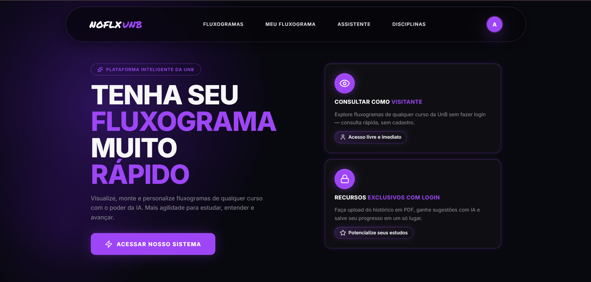
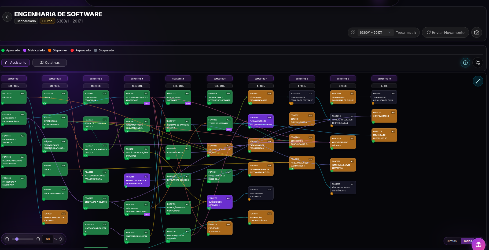
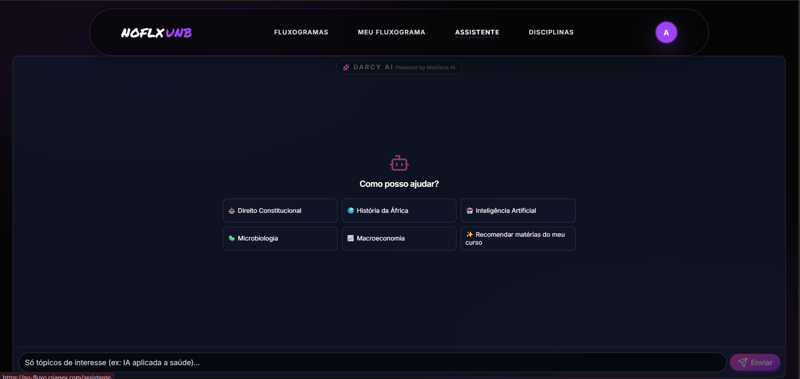

# Descrição do Software

Esta seção detalha as características operacionais, o ambiente de uso e o perfil dos usuários do [No FLuxo UnB](#ref01), fornecendo a base de contexto para a avaliação de qualidade de software. A descrição seguiu como base as diretrizes de [Ramos (2026)](#ref02), que contêm perguntas base para a descrição do produto.

## Funcionalidades e Tarefas

O produto é composto por aproximadamente **15 funções principais** na interface de usuário (UI):

1. Acesso/Login (via autenticação Google ou criação de conta);
2. Criar conta;
3. Fazer *upload* do histórico escolar;
4. Adicionar o histórico via integração com o SIGAA;
5. Visualização do fluxograma pessoal;
6. Visualizar grafo completo do curso com os pré-requisitos de cada disciplina;
7. Adicionar disciplinas optativas ao fluxograma;
8. Adaptar o fluxograma para outra matriz curricular;
9. Visualizar carga horária e IRA;
10. Simular mudança de curso;
11. Assistente Darcy (Agente de IA para sanar dúvidas);
12. Buscar disciplinas (por código ou nome na base de dados da UnB);
13. Suporte;
14. Buscar fluxogramas de outros cursos;
15. Simular mudança de curso (com simulação de integração e matérias equivalentes concluídas);

## Tarefas realizadas

As tarefas primárias que o usuário executa na plataforma são:

* Fazer o *upload* do seu histórico escolar em formato PDF;
* Visualizar o seu fluxograma recomendado, baseado no histórico realizado e no previsto para o curso;
* Compreender visualmente os pré-requisitos para a matrícula em matérias futuras;
* Planejar optativas e simular mudanças de curso;
* Interagir com a inteligência artificial para buscar disciplinas optativas e pesquisar matérias na base de dados da UnB.

Figura 1 – Interface inicial da plataforma No Fluxo UNB.

Fonte: Do autor (2026).

---

## Funções Alvo da Avaliação

Considerando o escopo do projeto, a avaliação de qualidade concentrará seus esforços nos módulos de maior impacto na experiência do usuário e na integridade dos dados, descritos a seguir:

* **Módulo Meu Fluxograma:** Este componente centraliza uma alta densidade de informações visuais e conexões topológicas (grafos). Devido à sua complexidade estrutural, torna-se um ponto crítico para a validação de critérios de usabilidade, inteligibilidade e acessibilidade, exigindo uma análise minuciosa para garantir que a carga cognitiva do usuário não seja afetada negativamente.

Figura 2 – Interface do módulo Meu Fluxograma.

Fonte: Do autor (2026).

* **Módulo de Importação de Histórico (Upload/SIGAA):** Representa a principal porta de entrada de dados do sistema. A avaliação dedicará atenção especial à eficiência do processamento do arquivo PDF e à robustez da integração com o SIGAA, validando o tratamento de erros e a integridade das informações importadas.

Figura 3 – Interface de importação de histórico acadêmico.

Fonte: Do autor (2026).

* **Módulo Assistente Darcy AI:** Por se tratar de um agente de inteligência artificial generativa, este módulo requer atenção dedicada no que tange à conformidade e confiabilidade das respostas, avaliando a precisão do processamento de linguagem natural (PLN) no domínio das regras acadêmicas da UnB.

Figura 4 – Interface do Assistente Darcy AI.

Fonte: Do autor (2026).

---

## Janelas de interação de dados com o usuário que o produto possui

O sistema possui, em média, **5 janelas principais** de interação direta (entrada e saída de dados):

1. Modal de *Upload* de Histórico (PDF);
2. Modal de Autenticação/Integração com o SIGAA;
3. Janela de Chat com o Assistente Darcy AI;
4. Janela/Modal de detalhamento de uma disciplina e seus requisitos;
5. Barra de busca e filtros na listagem de cursos.

## Usuários e Ambiente

O público-alvo principal é composto pelos **estudantes de graduação da Universidade de Brasília (UnB)**.

O produto será inserido em um **ambiente acadêmico online de uso cotidiano**. Trata-se de uma aplicação web responsiva operada sob demanda, que é acessada remotamente, de onde o estudante estiver, por meio de navegadores em desktops, tablets ou smartphones.

### Nível de conhecimento exigido dos usuários em relação à informática

**Básico.** É necessário apenas que o usuário saiba utilizar um navegador web, fazer login no sistema e realizar o envio (*upload*) de um arquivo PDF.

### Nível de conhecimento exigido dos usuários em relação ao domínio da aplicação em si

**Básico a Intermediário.** O usuário precisa compreender minimamente o ecossistema acadêmico da UnB (conceitos como pré-requisitos, créditos e matérias optativas). A interface busca apresentar as informações de forma clara, contudo, a densidade visual dos grafos pode exigir um esforço inicial de adaptação para determinados grupos de usuários.

---

## Aspectos Técnicos e de Avaliação

### Quais são os principais componentes sob avaliação?

A arquitetura do software objeto desta avaliação divide-se nos seguintes componentes estruturais:

* **Módulo de Entrada de Dados:** Interfaces gráficas de autenticação, login e envio de arquivos;
* **Módulo de Processamento de Regras:** Motor lógico responsável pelo cruzamento das regras acadêmicas da universidade com os dados extraídos do histórico;
* **Módulo de Renderização (Dashboard UI):** Interface web responsável pelo desenho dinâmico do fluxo e mapeamento das cores topológicas.

### Existe massa de dados disponível para a avaliação (dados-exemplos para agilizar)?

**Sim.** O banco de dados do sistema já está populado com as matrizes curriculares de **518 cursos** da UnB. Para a validação, serão utilizados arquivos PDF de históricos escolares anonimizados ou fictícios no padrão emitido pelo SIGAA, viabilizando os testes de processamento e interface de forma segura e ágil.

### Quais são os requisitos de hardware e software para executar o produto?

* **Requisitos de Software:** Um navegador web moderno e atualizado (Google Chrome, Mozilla Firefox, Microsoft Edge, Safari, etc.).
* **Requisitos de Hardware:** Dispositivo básico (computador, tablet ou smartphone) com tela capaz de exibir a interface gráfica e acesso contínuo a uma conexão estável de internet, dado que o processamento principal ocorre no lado do servidor.

---

## Referências

NO FLUXO UNB. **Plataforma de acompanhamento e planejamento de fluxo acadêmico**. Versão 1.0. Brasília: Crianex, 2026. Disponível em: [https://no-fluxo.crianex.com/](https://no-fluxo.crianex.com/). Acesso em: 5 jun. 2026.

RAMOS, Cristiane Soares. **Processo de Avaliação de Produto de Software**. Brasília: Universidade de Brasília, Faculdade do Gama, 2025. 21 slides. Material de aula da disciplina FGA0278 - Qualidade de Software 1. [link para o slide](../assets/referencia/slide_processo_avaliacao.pdf)

## Declaração do uso de IA

Eu, [Ana Luiza](https://github.com/Ana-Luiza-SC), declaro que utilizei a inteligência artificial Gemini para correções na estrutura textual e gramatical, sendo utilizada apenas na etapa final da produção do texto.

## Histórico de versão

| Versão | Data | Descrição | Autor |
|---|---|---|---|
| 1.0 | 12/05/26 | Escrita do conteúdo do documento | Ana Luiza |
| 1.1 | 12/05/26 | Criação da página inicial | Camila Careli |
| 1.2 | 12/05/26 | Revisão do conteúdo | Camila Careli |
| 1.3 | 05/05/26 | Adaptação do conteúdo para seguir a referência escolhida e realizar correções no conteúdo | Ana Luiza |