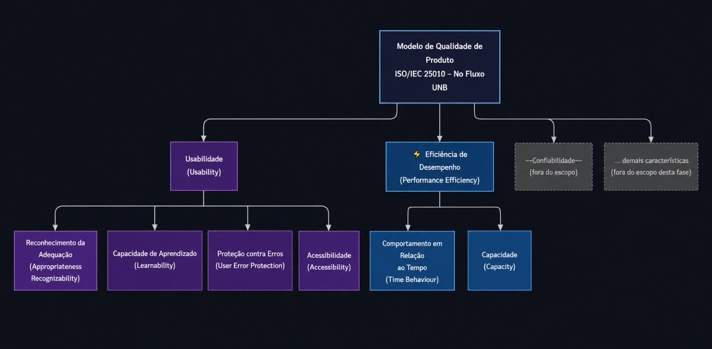

## Como chegamos nessas características

Para definir o modelo de qualidade, tomamos como base a norma **ISO/IEC 25010:2011**, integrante da série SQuaRE, que estrutura a qualidade de software em características bem delimitadas. Ela funciona como um guia orientador: indica o que deve ser avaliado e por qual razão.

### Características Selecionadas

Nesta fase inicial da avaliação, as características de qualidade foram escolhidas a partir dos objetivos definidos e do perfil dos usuários finais do produto, com o propósito de identificar os aspectos mais críticos para a experiência de planejamento acadêmico e para o desempenho geral do sistema.

Foram priorizadas as características de Usabilidade e Eficiência de Desempenho, devido à sua relação direta com a facilidade de aprendizado, prevenção de erros, agilidade no tempo de resposta da aplicação e capacidade de suportar os diferentes tipos de fluxogramas propostos pela universidade, visando garantir aspectos fundamentais para um público composto por estudantes da Universidade de Brasília (UnB), que necessitam de uma ferramenta prática, rápida e de fácil entendimento para contornar a complexidade existente nos fluxos de disciplinas.

### 1. Usabilidade

* **Reconhecimento da Adequação** *(Appropriateness Recognizability)*: Avalia se o estudante, ao acessar o sistema pela primeira vez, consegue perceber que a ferramenta foi desenvolvida para auxiliar no planejamento da grade curricular com base no seu histórico acadêmico. A interface deve deixar isso evidente — por meio de elementos visuais e instruções claras — sinalizando que o upload do histórico e a escolha do fluxograma são o ponto de partida, de modo que o usuário não tenha dúvidas sobre estar no lugar certo.
  
* **Capacidade de Aprendizado** *(Learnability)*: Mede a facilidade com que um estudante consegue, sem precisar de ajuda externa, compreender o fluxo de uso: enviar o histórico, selecionar o curso e interpretar o resultado visual com as disciplinas organizadas por status e semestre.
  
* **Proteção contra Erros do Usuário** *(User Error Protection)*: Verifica se o sistema previne o estudante de cometer erros comuns, como o envio de um arquivo em formato inválido, a escolha de um fluxograma incompatível com seu curso ou a interpretação equivocada de pré-requisitos.
  
* **Acessibilidade** *(Accessibility)*: Avalia em que medida o sistema pode ser utilizado de forma eficaz por estudantes com diferentes características e capacidades físicas ou cognitivas, incluindo limitações relacionadas à idade ou a deficiências diversas.
  
### 2. Eficiência de Desempenho

* **Comportamento em Relação ao Tempo** *(Time Behaviour)*: Examina a velocidade de resposta após o envio do histórico e a seleção do fluxograma. Examina o intervalo até que o sistema processe as regras de pré-requisitos e exiba o resultado visual deve ser suficientemente curto para não gerar frustração no usuário.
  
* **Capacidade** *(Capacity)*: Verifica se o sistema é capaz de lidar com a variedade de fluxogramas disponíveis e com a diversidade de históricos escolares enviados, que podem variar em tamanho, formato e quantidade de disciplinas.
  
---

## A relação entre as duas características

Essas duas características não são independentes — elas se influenciam. Um sistema que responde dentro dos tempos esperados tende a ser mais utilizável, pois reduz a carga cognitiva do usuário durante a interação. E um sistema com boa usabilidade permite que o usuário conclua as tarefas sem erros, o que gera menos reprocessamentos e, consequentemente, menos pressão sobre o desempenho.

Na prática, analisar as duas características em conjunto contribui para entender não apenas *o que* está acontecendo, mas *por quê* — se uma dificuldade de uso tem origem em um problema de interface ou em uma limitação no tempo de resposta, por exemplo.

---

## O que ficou fora do escopo e por quê

Nem tudo do modelo ISO/IEC 25010 foi incluído. As escolhas foram intencionais:

- **Confiabilidade** e **Segurança** são características importantes para este software por conta da privacidade do usuário, mas a **Usabilidade** e **Eficiência** se destacaram como mais importantes;
- **Manutenibilidade** e **Portabilidade** não são preocupações centrais para um sistema web de acesso público nesta fase;
- Dentro de **Eficiência de Desempenho**, a subcaracterística **Capacidade** recebeu atenção por refletir a diversidade de cursos e históricos que o sistema precisa suportar;
- Dentro de **Usabilidade**, a subcaracterística **Acessibilidade** foi incluída por ser relevante para um público universitário com características variadas.

---

## Representação Gráfica do Modelo de Qualidade

O diagrama abaixo mostra como o modelo foi estruturado:

> **Legenda:**

> - **Roxo** — Usabilidade e suas subcaracterísticas (em escopo);

> - **Azul** — Eficiência de Desempenho e suas subcaracterísticas (em escopo);

> - **Cinza tracejado** — Características excluídas do escopo desta avaliação;

---

## Escopo, Profundidade e Objetos de Avaliação

| Dimensão | Descrição |
|---|---|
| **Abrangência** | Sistema web No Fluxo UNB em produção, acessível em https://no-fluxo.crianex.com |
| **Objetos de avaliação** | Módulo Meu Fluxograma (renderização e interação), Módulo de Importação de Histórico (upload SIGAA), Assistente Darcy AI (integração com Maritaca AI) |
| **Profundidade** | Avaliação caixa-preta com medições de tempo de resposta, testes de carga e verificação de comportamento em cenários de uso |
| **Relação com fases futuras** | Os resultados desta fase vão alimentar a definição das métricas e dos limiares de aceitação utilizados nas próximas etapas da avaliação |

---

## Referências

- Documento elaborado com base na norma ISO/IEC 25010:2011 e nas diretrizes da disciplina FGA315 — Qualidade de Software.
- Avaliação referente ao software [No Fluxo UNB](https://no-fluxo.crianex.com/)

---

## Histórico de versão

| Versão | Data | Descrição | Autor |
|---|---|---|---|
| 1.0 | 12/05/26 | Criação da página de Modelo | André João |
| 1.1 | 13/05/26 | Correção das características | Ígor Veras |
| 1.2 | 04/06/26 | Correção do diagrama e ajustes finais | André João |
